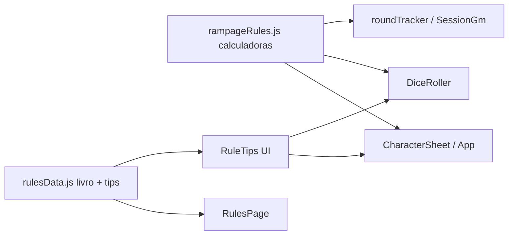

# Plano: aplicar regras Rampage (híbrido)

**Overview:** Migrar a ficha para FIS/DES/MEN/CAR, sincronizar o livro de regras definitivo no app, aplicar o núcleo mecânico (CA, descanso, Overheat, regen por turno, críticos/Air Break) e adicionar lembretes contextuais para o restante.

## Todos

- [ ] Criar rampageRules.js; migrar stats para FIS/DES/MEN/CAR; corrigir CA e descanso curto
- [ ] Overheat ao zerar barras + bloqueio de gasto; regen PE/Éter no avanço de turno
- [ ] Tips de crítico 1/2/19/20, Air Break opcional e sugestão de ferimento por % PV
- [ ] Sincronizar rulesData com o DOCX; Lore page; RuleTips contextuais + presets GM

## Decisões fixas

- **Atributos (1A):** migrar a ficha para `fis`, `des`, `men`, `car` + `inata`, `arteDivina`, `magica`. Conversão automática de fichas antigas: `fis = ceil((for+con)/2)`, `men = ceil((int+sab)/2)`, manter `des`/`car`/especiais.
- **Escopo (2A):** aplicar o núcleo mecânico no código; o resto vira lembrete contextual + livro de regras completo em `/regras`.
- Fonte mecânica: `RAMPAGE_Livro_de_Regras.docx`. Lore/World Bible entram como referência pesquisável (secundário).

## Arquitetura

Novo módulo central: `src/utils/rampageRules.js` — CA, descanso, Overheat, regen por turno, thresholds de ferimento, detecção Air Break/crítico, migração de stats. UI só chama o engine; não duplicar fórmulas.

## 1. Schema da ficha + migração

Arquivos: `src/App.jsx`, `src/utils/sheetIO.js`, `src/components/CharacterSheet.jsx`

- `emptySheet.stats` → `{ fis, des, men, car, inata, arteDivina, magica }`
- Em `buildUpdatedSheet` / load: se detectar keys antigas (`for`/`con`/…), converter uma vez e gravar no save seguinte
- Labels na UI: **FIS / DES / MEN / CAR / Inata / Arte Divina / Mágica**
- Barra `inata` permanece na key interna, label **PE**
- Campo mágico: adicionar **Abjuração**; manter redução de custo por campo dominante
- Sanidade: marcar como opcional/narrativa (não remover dado antigo se existir; sumir da UI principal ou recolher)
- Nível mínimo sugerido 3 na criação (hint + default `level: 3` em fichas novas)

## 2. Núcleo mecânico a aplicar

Arquivos: `rampageRules.js`, `App.jsx`, `CharacterSheet.jsx`, `DiceRoller.jsx`, `roundTracker.js` / `SessionGmPanel.jsx`

| Regra | Comportamento no app |
| --- | --- |
| **CA** | `floor(1.5×nível + FIS/4 + DES/4) + caArmorMod` (substituir fórmula D&D atual) |
| **Descanso curto** | +`floor(atual/2)` em PV/PE/Éter/Vigor (50% das barras **atuais**, não do máximo) |
| **Descanso longo** | Manter restore total + Inspiração/Certeza (já existe); garantir arredondamentos `floor` onde couber |
| **Overheat** | Ao zerar PE/Éter/Vigor: flag `overheat.{pe\|ether\|vigor}`; bloquear gasto daquele recurso até recuperar ≥ metade do máximo ou descanso longo |
| **Regen no turno** | No avanço de turno do personagem na sessão: `PE += 10×nível`, `Éter += 5×nível` (cap no max); Vigor sem regen automática |
| **Críticos no d20** | Após rolagem: banner/tip com efeito oficial — 1 falha crítica, 2 falha leve, 19 dobra dados de dano, 20 dobra + vantagem narrativa |
| **Air Break** | Se total final de ataque (d20+mod) for múltiplo de 7 **e** não for 19/20 no d20: alerta + botão opcional “Aplicar Air Break” (dano×2,5 lembrete + recuperar metade das barras atuais) |
| **Ferimentos** | Ao aplicar dano em PV: se golpe ≥25/50/75% do PV máx, sugerir Ferimento Leve/Grave/Crítico (adicionar effect com 1 clique) |

Não automatizar nesta fase: Close Quarters completo, votos, velocidade/força relativa (só tabelas/tips), ataque conjunto como fluxo completo, morte/salva-guarda além de tip.

## 3. Lembretes contextuais

- Componente leve `RuleTip` / chips que leem keys de `rulesData.js` (ex.: `crit-19`, `air-break`, `overheat`, `ferimentos`, `esquiva`, `agirentar`)
- Pontos de injeção: DiceRoller (pós-roll), Status/barras (Overheat), Descanso, painel CA, botão “Usar habilidade”
- Na sessão GM: preset de lembretes Rampage opcional (regen PE/Éter, ação completa/bônus/reação) — reutiliza reminders de `SessionGmPanel`

## 4. Livro de regras + lore

- Reescrever `src/data/rulesData.js` a partir do DOCX: seções Partes I–XIV + Apêndices (fórmulas, gatilhos 1/2/19/20, Air Break, ferimentos, tabelas principais)
- Melhorar `RulesPage.jsx`: sumário âncora + busca simples
- Lore: página ou aba **Lore** com conteúdo do `LORE.pdf` (texto limpo); World Bible como seção **Mestre** (ou item na biblioteca) — não misturar com regras mecânicas

## 5. Fora de escopo (de propósito)

- Motor completo de combate (resolução ataque→defesa→dano automática)
- Validação de Votos / Maestria / Estudo
- Remover modos/equipamento livres
- Enforçar distribuição de pontos na criação (só hints)

## Ordem de implementação

1. `rampageRules.js` + migração de stats + CA + descanso curto
2. Overheat + bloqueio de gasto + regen no turno
3. DiceRoller: tips críticos + Air Break + ferimento sugerido
4. Sync `rulesData` + Lore + RuleTips
5. Smoke manual: ficha antiga migra; CA; descanso; zerar barra; d20 19/20; total múltiplo de 7
